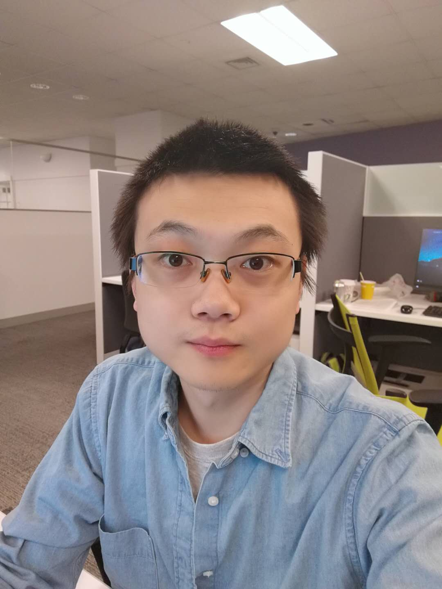

I am now a third year PhD student in NYU Tandon School of Engineering majoring in Computer Science. But I am currently staying in NYUAD (New York University Abu Dhabi).

I received my **Master** degree from the Computer Science and Engineering department of _NYU_ School of Engineering.
Before that, I received my two **Bachelor** degrees in Information Security and Law (as two seperate degrees) from _Nankai University_.

My research interests include:

- Security & Machine Learning
- GPS Security
- Machine Learning (Deep Learning)
- Computer Vision

Here is my Résumé:
[Résumé](/cv.pdf)
